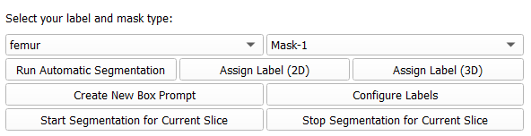
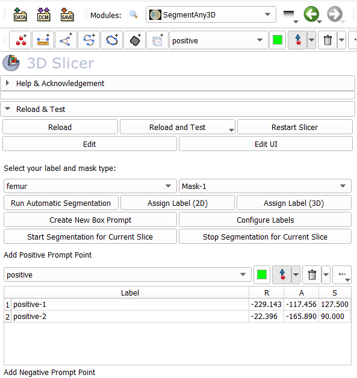

# SlicerSegmentHumanBody

[](https://arxiv.org/abs/2401.12974)

SegmentHumanBody aims to asist its users in segmenting medical data on <a href="https://github.com/Slicer/Slicer">3D Slicer</a> by integrating the <a href="https://github.com/mazurowski-lab/SegmentAnyBone">SegmentAnyBone</a> developed by Mazurowski Lab.

## License

The repository is licensed under the [CC BY-NC 4.0](https://creativecommons.org/licenses/by-nc/4.0/)

## Installation via GitHub Repository

You can clone this repository by running the following command:

```
git clone https://github.com/mazurowski-lab/SlicerSegmentHumanBody.git
```

After cloning the repository, you need to introduce the extension to 3D Slicer. Please go to Modules > Developer Tools > Extension Wizard on 3D Slicer and click 'Select Extension' button. You should select the root folder that contains this repository in the pop-up. If you don't get any error on Python terminal, that means you are ready to use the extension!

## Usage

### Preparation

- Load an image to be segmented. For example, you can use CTLiver data set from **Sample Data** module.
- Choose **Modules > Segmentation > SegmentHumanBody** module in the module selector. The first time the module is started, it will ask permission to install pytorch. Give permission and wait several minutes for the installation to complete. The application will not be responsive during the installation.
- Click "Configure labels in the segment editor" button to create a label for each structure that will be segmented. For example, "hip" and "femur".
- Go back to **SegmentHumanBody** module by clicking the green left arrow on the module toolbar. You are ready to segment now!

### Automatic Segmentation

 

- Click "Run Automatic Segmentation" button and wait until the processing is completed (it may take 5-10 minutes). SegmentAnyBone will run in automated mode and will segment bones in each slice it can detect.
- For each structure of interest: choose a label (above the "Run automatic segmentation" button, for example: "hip") and click "Assign label (2D)" or "Assign label (3D)" button
  - **2D Label Assignment:** Change label of the connected component *only in the current slice*.
  - **3D Label Assignment:** Change label of the connected component *through consecutive slices in 3D*.

### Prompt Based Segmentation



- Select the label you want to segment from the dropdown list (for example "hip" as shown in the image below).
- Click "Start Segmentation for Current Slice" button.

If it is the first to segment a slice of this file, you need to wait for SegmentAnyBone to produce some files that will be used for the segmentation. After SegmentAnyBone generated these files, you can start putting **prompt points** or **prompt boxes** on the current slice. You'll be able to see the segmentation mask on 3D Slicer. Please click "Stop Segmentation for Current Slice" whenever you finish your segmentation for the current slice.

If you are not satisfied with the segmentation mask produced by SegmentAnyBone, you can edit it as you wish using the "Segment Editor" module of 3D Slicer.

## Citation

If you find our work to be useful for your research, please cite [our paper](https://arxiv.org/abs/2401.12974):

```bibtex
@misc{gu2024segmentanybone,
      title={SegmentAnyBone: A Universal Model that Segments Any Bone at Any Location on MRI},
      author={Hanxue Gu and Roy Colglazier and Haoyu Dong and Jikai Zhang and Yaqian Chen and Zafer Yildiz and Yuwen Chen and Lin Li and Jichen Yang and Jay Willhite and Alex M. Meyer and Brian Guo and Yashvi Atul Shah and Emily Luo and Shipra Rajput and Sally Kuehn and Clark Bulleit and Kevin A. Wu and Jisoo Lee and Brandon Ramirez and Darui Lu and Jay M. Levin and Maciej A. Mazurowski},
      year={2024},
      eprint={2401.12974},
      archivePrefix={arXiv},
      primaryClass={eess.IV}
```
